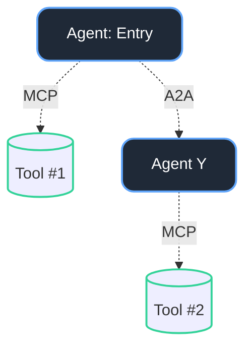
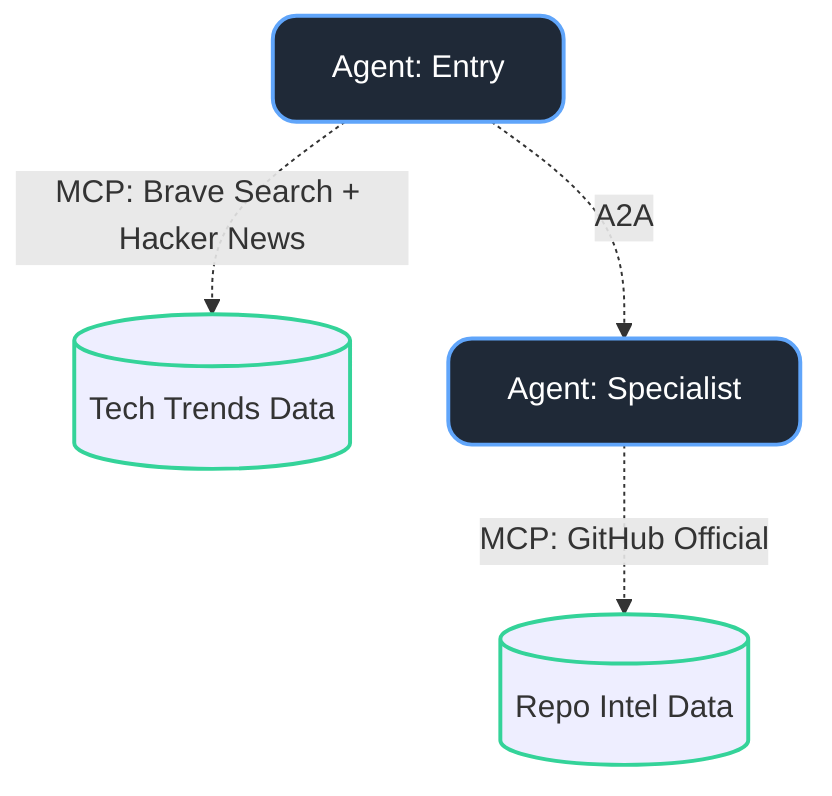
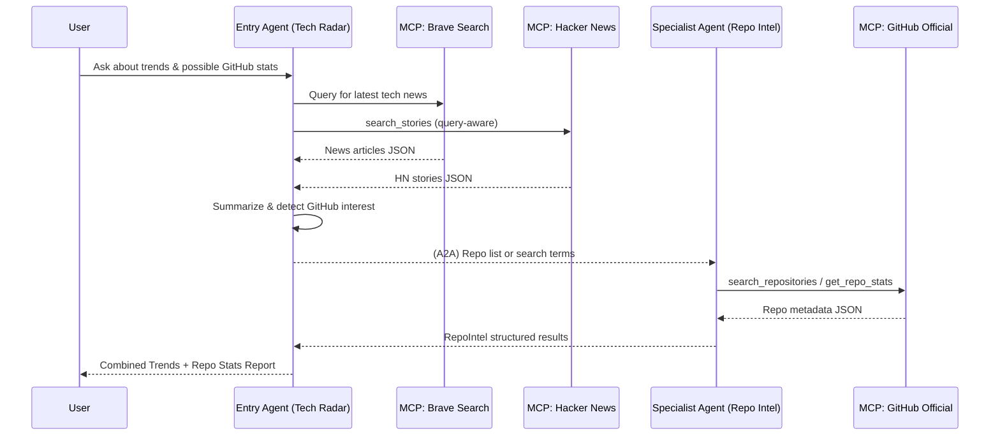

# Example of 2 Agents with 2 Tools using MCP and A2A 

## This example demonstrates how to set up two agents that utilize MCP tools and communicate with each other using A2A (Agent-to-Agent) communication and must be made with use of PydanticAI - FastAPI - Docker MCPToolkit.

## These agent must use explicitly the following tools to be made:

### Pydantic-Documentation:

* For A2A communication, the agents will use the Pydantic-AI A2A server:
  
https://ai.pydantic.dev/a2a/
https://ai.pydantic.dev/a2a/#pydantic-ai-agent-to-a2a-server

* For MCP communication, the agents will use the MCP server:
  
https://ai.pydantic.dev/mcp/#mcp-servers
https://ai.pydantic.dev/multi-agent-applications/#agent-delegation-and-dependencies

* For any other code used related to pydantic-ai, please refer to the Pydantic-AI documentation:
  
https://ai.pydantic.dev/

### For FastAPI: ###

* For FastAPI, the agents will use the FastAPI framework refer to latest documentation:
  
https://fastapi.tiangolo.com/

### For Docker MCPToolkit: ###

* For Docker MCP Toolkit, the agents will use the MCP Toolkit to run the MCP servers and preferably use Brave Search or any other MCP server needed for example:
  
https://docs.docker.com/ai/mcp-catalog-and-toolkit/toolkit/
https://docs.docker.com/ai/mcp-gateway/
https://docs.docker.com/ai/mcp-catalog-and-toolkit/toolkit/example-use-the-github-official-mcp-server
https://www.docker.com/blog/introducing-docker-mcp-catalog-and-toolkit/

# This is the main archhitecture of the agents and tools used in this example:

# Code Trend Tracker — 2 Agents, 2 MCP Tools, A2A

This project demonstrates a **2-agent architecture** using **Pydantic-AI**, **FastAPI**, and **Docker MCPToolkit**.

## Concept
- **Entry Agent ("Tech Radar")** → Pulls latest developer trends from **Brave Search MCP** + **Hacker News MCP**. (if useful use this repo: https://github.com/erithwik/mcp-hn?tab=readme-ov-file and always use rate api limits of Hacker News MCP)
- **Specialist Agent ("Repo Intel")** → Triggered when the query requests GitHub repo metrics, correlation, or trending projects. Uses **GitHub Official MCP** for live repo data.

---

## Architecture (Simple)

