# Tech Trends Agent 🚀

**A robust, scalable AI-powered web service combining FastAPI, Pydantic-AI, and MCP servers**


[](https://www.python.org/downloads/)
[](https://fastapi.tiangolo.com/)
[](https://ai.pydantic.dev/)
[](https://www.docker.com/)

This project demonstrates how to build a production-ready AI-powered web service by combining three cutting-edge, open-source technologies:

1. **FastAPI** for high-performance asynchronous APIs
2. **Pydantic-AI** for type-safe, schema-driven agent construction
3. **Model Context Protocol (MCP)** servers as plug-and-play tools


A quick glance at the UI: type a question, choose sources (Hacker News and/or Web Search), then get ranked trend cards with scores, links, and an AI-written summary—so you can quickly see what's trending about any topic or technology.

## 🎯 What You'll Learn

- Advanced data modeling patterns with Pydantic
- Multi-agent AI systems with A2A communication
- MCP server integration for extensible AI tools
- Production-ready FastAPI deployment patterns
- Docker containerization for AI services
- Type-safe AI agent development

## 🏗️ Architecture

```mermaid
flowchart TD
    subgraph UI["🌐 Web UI + Docs"]
        U["👤 User"] -->|HTTP| FA["🚀 FastAPI<br/>(app/main.py)"]
    end

    subgraph CORE["🎯 Orchestration"]
        dummy[" "]:::hidden
        FA --> AM["AgentManager"]
        AM --> GA["🤖 GeneralAgent<br/>Classifier / Chat"]
        AM --> EA["🤖 EntryAgent<br/>Tech Radar"]
        AM --> SA["🤖 SpecialistAgent<br/>Repo Intel"]
        GA -->|handoff| EA
        EA <--> A2A["A2A Protocol"]
        SA <--> A2A
    end

    subgraph TOOLS["🔌 Tooling"]
        EA --> BS["🔍 Brave Search MCP<br/>(active)"]
        EA --> HN["📰 Hacker News MCP<br/>(active)"]
        SA --> GH["🐙 GitHub MCP<br/>(optional)"]
        EA --> FS["📁 Filesystem MCP<br/>(optional)"]
        SA --> FS
    end

    classDef agent fill:#ffffff,color:#111827,stroke:#60a5fa,stroke-width:2px,rx:10,ry:10
    classDef svc fill:#f8fafc,color:#111827,stroke:#0288d1,stroke-width:2px,rx:10,ry:10
    classDef toolActive fill:#ffffff,color:#111827,stroke:#16a34a,stroke-width:2px,rx:10,ry:10
    classDef toolDisabled fill:#ffffff,color:#111827,stroke:#f59e0b,stroke-width:2px,rx:10,ry:10
    classDef hidden fill:transparent,stroke:transparent

    class EA,GA,SA agent
    class FA,AM,A2A svc
    class BS,HN toolActive
    class GH toolDisabled
```



## 🚀 Quick Start (Docker - Recommended)

### Prerequisites

- Docker and Docker Compose
- OpenAI API key (required)
- GitHub token (optional, for enhanced GitHub features)

### 1. Clone and Setup

```bash
git clone <your-repo-url>
cd Tech_Trends_Agent
```

### 2. Configure Environment

```bash
# Copy environment template
cp env.example .env

# Edit .env with your API keys
vi .env  # or your preferred editor
```

Required environment variables:
```env
OPENAI_API_KEY=your_openai_api_key_here
GITHUB_TOKEN=your_github_token_here  # Optional but recommended
BRAVE_API_KEY=your_brave_api_key
```

### 3. Start the App

```bash
# Start with Docker (recommended)
./docker-start.sh

# Or manually with docker-compose
docker-compose up --build -d
```

### 4. Access the Application

- **Web UI**: http://localhost:8000/ui
- **Interactive API Documentation**: http://localhost:8000/docs
- **ReDoc Documentation**: http://localhost:8000/redoc
- **Health Check**: http://localhost:8000/health

### 5. Stop the App

```bash
# Stop the application
./docker-stop.sh

# Or manually
docker-compose down
```

## 🐍 Development Setup (Alternative)

If you prefer to run without Docker:

```bash
# Create and activate virtual environment
python -m venv venv
source venv/bin/activate  # On Windows: venv\Scripts\activate

# Install dependencies
pip install -e .

# Start the application
python -m app.main
```

## 📊 API Endpoints

### Core Analysis Endpoints

#### 🔍 Tech Trends Analysis
```http
POST /api/v1/trends
Content-Type: application/json

{
  "query": "latest AI frameworks",
  "limit": 10,
  "include_hn": true,
  "include_brave": true
}
```

#### 📈 Repository Intelligence
```http
POST /api/v1/repositories
Content-Type: application/json

{
  "repositories": ["tiangolo/fastapi", "pydantic/pydantic-ai"],
  "include_metrics": true,
  "include_recent_activity": true
}
```

#### 🔗 Combined Analysis
```http
POST /api/v1/combined-analysis
Content-Type: application/json

{
  "query": "Python web frameworks 2024",
  "auto_detect_repos": true,
  "max_repos": 5,
  "trend_limit": 15
}
```

#### 🧠 Unified Assistant (Intent Routing)
```http
POST /api/v1/assistant
Content-Type: application/json

{
  "input": "Where is Athens?",
  "limit": 10,
  "include_hn": true,
  "include_brave": true
}

Response when routed to chat:
{
  "route": "chat",
  "data": { "response": "...", "message_type": "general", "timestamp": "..." },
  "timestamp": "..."
}

Response when routed to trends:
{
  "route": "trends",
  "data": { "query": "...", "trends": [...], "summary": "...", "analysis_timestamp": "..." },
  "timestamp": "..."
}
```

Other helpful endpoints:
- `GET /api/v1/agents/status`
- `GET /api/v1/mcp/status`
- `GET /api/v1/files`
- `GET /api/v1/history`, `GET /api/v1/history/{id}`

### Monitoring Endpoints

- `GET /health` - Application health check
- `GET /api/v1/agents/status` - Agent status information
- `GET /api/v1/mcp/status` - MCP server status

## 🤖 Agent System

### Entry Agent (Tech Radar)
- Analyzes technology trends using Brave Search and Hacker News
- Identifies emerging technologies and frameworks
- Detects GitHub repositories mentioned in trends
- Delegates repository analysis to Specialist Agent

### Specialist Agent (Repo Intel)
- Performs detailed GitHub repository analysis
- Provides repository health metrics and insights
- Correlates repository data with technology trends
- Generates competitive analysis and recommendations

### A2A Communication
Agents communicate through Pydantic-AI's Agent-to-Agent (A2A) protocol:
- Type-safe message passing
- Correlation tracking
- Error handling and retries

## 🔧 MCP Server Integration

### What are MCP Servers?
Model Context Protocol (MCP) servers provide standardized interfaces for AI tools:
- **Pluggable Architecture**: Easy to add new capabilities
- **Type Safety**: Schema-driven tool definitions
- **Scalability**: Distributed tool execution
- **Security**: Sandboxed tool execution

### Available Tools

#### Hacker News MCP (Active)
- Top stories and trending content via MCP tools
- Filtered by relevance and recency
- **Status**: ✅ Active (see `hackernews-mcp-custom`)

#### Brave Search MCP (Active)
- Brave Search API integration via MCP server
- Structured results with relevance and quality scoring
- **Status**: ✅ Active (see `brave-search-mcp-custom`)

#### GitHub MCP (Disabled by default)
- Repository search and details
- **Status**: ❌ Disabled by default; enable in `docker-compose.yml` and provide `GITHUB_TOKEN`

#### Filesystem MCP (Disabled)
- Secure file operations
- Read-only data access
- **Status**: ❌ Disabled (local file listing is exposed via `/api/v1/files` instead)

## 🐳 Docker Deployment

### Quick Start (Recommended)

```bash
# Start Tech Tracker with one command
./docker-start.sh

# Stop Tech Tracker
./docker-stop.sh
```

### Manual Docker Commands

```bash
# Build and start
docker-compose up --build -d

# View logs
docker-compose logs -f

# Stop services
docker-compose down
```

### Production Deployment

```bash
# Build production image
docker build -t tech-tracker:latest .

# Run with production settings
docker run -d \
  --name tech-tracker \
  -p 8000:8000 \
  -e OPENAI_API_KEY="your_key" \
  -e ENVIRONMENT="production" \
  tech-tracker:latest
```

### Current Tooling Status (from code and compose)

- Brave Search MCP: ✅ active on port 3001
- Hacker News MCP: ✅ active on port 3003
- GitHub MCP: ❌ disabled by default (uncomment in compose to enable)
- Filesystem MCP: ❌ disabled by default

## 🧪 Testing

```bash
# Install development dependencies
pip install -e ".[dev]"

# Run tests
pytest

# Run tests with coverage
pytest --cov=app --cov-report=html


# Type checking
mypy app/
```

## 🧹 Code Quality

Basic commands to format, lint, and scan the codebase:

- **Black (format)**
  - Format repo: `black .`
  - Check only: `black --check .`

- **Ruff (lint + fixes)**
  - Lint: `ruff check .`
  - Autofix: `ruff check . --fix`

- **Bandit (security scan)**
  - Scan app code: `bandit -r app`
  - Output to file: `bandit -r app -f txt -o bandit-report.txt`

## 📁 Project Structure

```
HN_Github_Agents/
├── app/
│   ├── agents/                 # AI agent implementations
│   │   ├── base_agent.py
│   │   ├── entry_agent.py
│   │   └── specialist_agent.py
│   ├── models/                 # Pydantic data models
│   │   ├── requests.py
│   │   ├── responses.py
│   │   └── schemas.py
│   ├── services/         # Business logic services
│   │   ├── a2a_service.py      # A2A protocol (Pydantic-AI)
│   │   └── agent_manager.py    # orchestrates agents + MCP
│   ├── utils/            # Utilities and configuration
│   │   ├── config.py
│   │   ├── logging.py
│   │   └── mcp_client.py
│   └── main.py           # FastAPI application
├── data/                 # Sample data for filesystem MCP
├── static/               # Web interface files
├── scripts/              # Setup and utility scripts
├── tests/                # Test suite
├── docker-compose.yml    # Docker services configuration
├── Dockerfile            # Application container
├── docker-start.sh       # Quick start script
├── docker-stop.sh        # Quick stop script
└── pyproject.toml        # Project configuration
```

## 🔍 Example Usage

### Analyze Python Web Framework Trends

```python
import httpx

async def analyze_python_trends():
    async with httpx.AsyncClient() as client:
        response = await client.post(
            "http://localhost:8000/api/v1/combined-analysis",
            json={
                "query": "Python web frameworks 2024 FastAPI Django Flask",
                "auto_detect_repos": True,
                "max_repos": 5,
                "trend_limit": 20
            }
        )
        
        result = response.json()
        
        print(f"Trends found: {result['trends']['total_items']}")
        print(f"Repositories analyzed: {result['repositories']['total_repos']}")
        print(f"Recommendations: {len(result['recommendations'])}")
        
        return result
```

### Monitor Repository Health

```python
repositories = [
    "tiangolo/fastapi",
    "django/django", 
    "pallets/flask",
    "pydantic/pydantic-ai"
]

async def monitor_repos():
    async with httpx.AsyncClient() as client:
        response = await client.post(
            "http://localhost:8000/api/v1/repositories",
            json={
                "repositories": repositories,
                "include_metrics": True,
                "include_recent_activity": True
            }
        )
        
        result = response.json()
        
        for repo in result['repositories']:
            stars = repo['metrics']['stars']
            health = "🟢" if stars > 10000 else "🟡" if stars > 1000 else "🔴"
            print(f"{health} {repo['full_name']}: {stars:,} stars")
```

## 🎨 Advanced Features

### Custom MCP Server Integration

Add your own MCP servers by:

1. **Updating docker-compose.yml**:
```yaml
  custom-mcp:
    image: your/custom-mcp-server
    ports:
      - "3005:3005"
    environment:
      - CUSTOM_API_KEY=${CUSTOM_API_KEY}
```

2. **Registering in the agent**:
```python
@self.agent.tool
async def custom_tool(ctx: RunContext[Any], param: str) -> Dict[str, Any]:
    client = self.mcp_manager.get_client("custom")
    return await client.call_tool("custom_operation", {"param": param})
```

### Extending Agent Capabilities

Create new agents by inheriting from `BaseAgent`:

```python
from app.agents.base_agent import BaseAgent

class CustomAgent(BaseAgent):
    def __init__(self):
        system_prompt = "You are a custom analysis agent..."
        super().__init__("custom_agent", system_prompt)
    
    async def process_request(self, request_data: Dict[str, Any]) -> Dict[str, Any]:
        # Your custom logic here
        pass
```

## 🔧 Configuration Options

Key configuration options in `app/utils/config.py`:

```python
from app.utils.config import settings

# MCP URLs (compose overrides for in-container calls)
settings.brave_search_mcp_url  # default http://localhost:3001
settings.github_mcp_url        # default http://localhost:3002 (disabled in compose)
settings.hacker_news_mcp_url   # default http://localhost:3003
settings.filesystem_mcp_url    # default http://localhost:3004

# App
settings.log_level            # INFO by default
settings.environment          # development by default
settings.hn_stories_limit     # default 50 (HN MCP fetch window)
settings.web_search_limit     # default 20 (Brave MCP)
```

## 🐛 Troubleshooting

### Common Issues

**MCP Servers Not Starting**
```bash
# Check Docker status
docker ps

# Restart MCP servers
./scripts/setup_mcp_servers.sh restart

# Check server logs
docker logs brave-search-mcp
```

**API Rate Limiting**
- GitHub: Ensure `GITHUB_TOKEN` is set for higher rate limits
- Hacker News: Built-in rate limiting prevents overloading

**Agent Initialization Errors**
```bash
# Check OpenAI API key
curl -H "Authorization: Bearer $OPENAI_API_KEY" \
     https://api.openai.com/v1/models

# Verify MCP server connectivity
curl http://localhost:3001/health
```

### Debug Mode

Enable debug logging:
```bash
export LOG_LEVEL=DEBUG
python -m app.main
```

## 🤝 Contributing

1. Fork the repository
2. Create a feature branch
3. Make your changes
4. Add tests for new functionality
5. Ensure all tests pass
6. Submit a pull request

### Development Setup

```bash
# Install development dependencies
pip install -e ".[dev]"

# Set up pre-commit hooks
pre-commit install

# Run the full test suite
pytest --cov=app
```

## 📚 Resources

- [FastAPI Documentation](https://fastapi.tiangolo.com/)
- [Pydantic-AI Documentation](https://ai.pydantic.dev/)
- [MCP Server Catalog](https://docs.docker.com/ai/mcp-catalog-and-toolkit/toolkit/)
- [Docker MCP Toolkit](https://docs.docker.com/ai/mcp-catalog-and-toolkit/toolkit/)

## 📄 License

This project is licensed under the MIT License - see the [LICENSE](LICENSE) file for details.

## 🎤 PyCon Presentation

This project was created as a demonstration for a PyCon tutorial:

**"Building Robust AI Web Services with FastAPI, Pydantic-AI, and MCP Servers"**

*In this 60-minute tutorial, learn how to build a production-ready AI-powered web service that combines high-performance APIs, type-safe agent construction, and pluggable tool integration.*

---

## 🔢 Understanding the Scoring System

The application uses dynamic scoring based on real data from active sources:

### **Score Origins**

1. **Web Search Results (1-100 Scale)** - *Active Scoring*
   - Based on: Search relevance, domain authority, content match
   - Algorithm: Enhanced relevance calculation with quality bonuses
   - Location: `app/agents/entry_agent.py:1614-1680`
   - Factors: Title matches (25-35pts), URL matches (15pts), Quality domains (+25pts)

2. **Hacker News Stories (1-100 Scale)** - *Live Weighted Scoring*  
   - Based on: HN points (50%) + Relevance (40%) + Recency (10%)
   - Algorithm: Weighted combination of multiple factors
   - Location: `app/agents/entry_agent.py:1130-1164`
   - Filters: Stories must be recent (within 60 days) and relevant

3. **Repository Health (0.0-1.0 Scale)** - *Calculated from GitHub API*
   - Based on: Stars (30%), Forks (20%), Activity (30%), Diversity (20%)
   - Algorithm: Normalized weighted scoring
   - Location: `app/agents/specialist_agent.py:328-360`
   - Real-time data from GitHub API (when available)

### **Current System Status**

- **✅ Active Sources**: Hacker News MCP, Brave Search MCP
- **⚠️ Fallback Mode**: GitHub API (direct calls when MCP unavailable)
- **❌ Disabled**: Filesystem MCP
- **Health Check**: Visit `/health` endpoint to see real-time status

## 📊 Detailed System Architecture

### **Complete Request Flow (Assistant Route)**


### **System Architecture & Data Flow**

```mermaid
flowchart TD
    %% User Interface Layer
    U[👤 User] --> UI[🌐 Frontend UI<br/>Vanilla JS SPA]
    UI --> |HTTP Requests| FA[🚀 FastAPI Server<br/>Port 8000]
    
    %% API Layer
    FA --> |Dependency Injection| AM[🎯 Agent Manager<br/>Orchestration Hub]
    
    %% Agent Layer
    AM --> EA[🤖 Entry Agent<br/>Tech Radar<br/>Pydantic AI]
    AM --> SA[🤖 Specialist Agent<br/>Repo Intel<br/>Pydantic AI]
    
    %% A2A Communication
    EA <--> |Agent-to-Agent<br/>Messages| A2A[📡 A2A Protocol]
    SA <--> A2A
    
    %% Data Sources Layer
    EA --> |MCP Active ✅| BS[🔍 Brave Search MCP]
    EA --> |MCP Active ✅| HN[📰 Hacker News MCP]
    SA --> |MCP opt ❌| GH[🐙 GitHub MCP]
    AM --> |Local Files| FD[📁 Local Data Access<br/>JSON Files]
    
    %% External APIs
    BS --> |MCP Protocol| BE[🌐 Brave Search API]
    HN --> |MCP Protocol| HE[📡 Hacker News API]
    GH --> |REST API| GE[🐱 GitHub REST API]
    
    %% Processing Flow
    subgraph "🎨 Frontend Processing"
        UI --> MD[📝 Markdown Renderer<br/>marked.js + Prism.js]
        UI --> SC[⭐ Score Display<br/>Dynamic Scoring]
        UI --> TC[🗂️ Trend Cards<br/>Interactive UI]
    end
    
    subgraph "🧠 AI Processing"
        EA --> |System Prompt| EP[💭 Tech Analysis<br/>OpenAI GPT]
        SA --> |System Prompt| SP[💭 Repo Intelligence<br/>OpenAI GPT]
        EP --> |Generates| AS[📋 Analysis Summary<br/>Markdown Format]
        SP --> |Generates| RI[📊 Repo Insights<br/>Correlation Scores]
    end
    
    subgraph "📊 Scoring System"
        BS --> |Relevance + Quality| S1[⭐ Web Score<br/>1-100 Scale]
        HN --> |HN Points + Recency| S2[⭐ HN Score<br/>Weighted Algorithm]
        GH --> |Stars/Forks/Activity| S3[⭐ Repo Health<br/>0.0-1.0 Scale]
    end
    
    subgraph "🔧 Configuration"
        CF[⚙️ Config Files<br/>.env<br/>settings.py]
        CF --> AM
        CF --> EA
        CF --> SA
    end
    
    %% Status Indicators
    HN -.-> |Status: Active ✅| ST1[Functional MCP]
    BS -.-> |Status: Active ✅| ST2[Full MCP Server]
    GH -.-> |Status: Fallback ⚠️| ST3[Demo Mode]
    
    %% Styling
    classDef userLayer fill:#e1f5fe,stroke:#01579b,stroke-width:2px,color:#000
    classDef apiLayer fill:#f3e5f5,stroke:#4a148c,stroke-width:2px,color:#000
    classDef agentLayer fill:#e8f5e8,stroke:#1b5e20,stroke-width:2px,color:#000
    classDef activeLayer fill:#dcfce7,stroke:#16a34a,stroke-width:2px,color:#000
    classDef fallbackLayer fill:#fef3c7,stroke:#f59e0b,stroke-width:2px,color:#000
    classDef externalLayer fill:#fce4ec,stroke:#880e4f,stroke-width:2px,color:#000
    classDef dataLayer fill:#f1f8e9,stroke:#33691e,stroke-width:2px,color:#000
    
    class U,UI userLayer
    class FA,AM apiLayer
    class EA,SA,A2A agentLayer
    class BS,ST1 activeLayer
    class HN activeLayer
    class GH,ST3 fallbackLayer
    class BE,HE,GE externalLayer
    class FD,CF,MD,SC,TC,EP,SP,AS,RI,S1,S2,S3 dataLayer
```



### **Key Architecture Components**

#### **🎯 Agent Manager (`AgentManager`)**
- **Purpose**: Central orchestration hub for all agents and services
- **Location**: `app/services/agent_manager.py`
- **Responsibilities**:
  - Initialize and manage agent lifecycle
  - Route requests to appropriate agents
  - Coordinate A2A communication
  - Manage MCP client connections
  - Health monitoring and error handling

#### **🤖 Entry Agent (`EntryAgent`)**
- **Purpose**: Tech trend analysis and general AI assistance
- **Location**: `app/agents/entry_agent.py`
- **Capabilities**:
  - Brave Search MCP integration for web trends
  - Hacker News story fetching and analysis
  - GitHub repository detection from trends
  - General chat for non-tech queries
  - A2A delegation to Specialist Agent

#### **🤖 Specialist Agent (`SpecialistAgent`)**
- **Purpose**: GitHub repository intelligence and analysis
- **Location**: `app/agents/specialist_agent.py`
- **Capabilities**:
  - Repository metrics analysis (stars, forks, activity)
  - Technology ecosystem mapping
  - Correlation score calculation
  - Growth potential assessment
  - Competitive landscape insights

#### **📡 A2A Protocol (`A2AService`)**
- **Purpose**: Agent-to-Agent communication using Pydantic-AI’s A2A protocol (`agent.to_a2a()`)
- **Location**: `app/services/a2a_service.py`
- **Notes**:
  - Registers agents and can expose ASGI handlers for A2A endpoints
  - `send_message` routes messages via the protocol; HTTP handlers return results immediately

#### **🔧 MCP Client Manager (`MCPClientManager`)**
- **Purpose**: Manage connections to available MCP servers
- **Location**: `app/utils/mcp_client.py`
- **Servers**:
  - **Hacker News MCP** (Port 3003): ✅ Story fetching and trends
  - **Brave Search MCP** (Port 3001): ✅ Web search with rich metadata
  - **GitHub MCP** (Port 3002): ❌ Disabled (uses direct API fallback)
  - **Filesystem MCP** (Port 3004): ❌ Disabled (uses local file access)

### **🔄 Data Flow Patterns**

1. **Tech Trends Flow**: User → UI → FastAPI → Entry Agent → HN MCP + Brave MCP → AI Analysis → Response
2. **Repository Analysis**: Entry Agent → A2A Protocol → Specialist Agent → GitHub MCP (optional) → Intelligence Report
3. **General Chat**: User → UI → FastAPI → Entry Agent (Direct AI) → Response
4. **Health Monitoring**: UI → FastAPI → Agent Manager → Active Services → Status Report
5. **File Processing**: @filename syntax → Local file system access → Content injection

## 🕐️ Current Implementation Status

### **What's Working**
- ✅ **Hacker News Integration**: Full MCP server with real-time story fetching
- ✅ **Web Search**: Brave Search MCP server with structured API responses
- ✅ **AI Analysis**: OpenAI GPT-powered trend analysis and insights
- ✅ **A2A Communication**: Agent-to-agent messaging system
- ✅ **File Processing**: @filename syntax for including data files
- ✅ **Interactive UI**: Full-featured web interface with markdown rendering

### **Demo/Fallback Mode**
- ⚠️ **GitHub Analysis**: Uses direct API calls instead of MCP server
- ⚠️ **Repository Intelligence**: Works with fallback data and API calls

### **Future Enhancements**
- 🔄 **Additional MCP Servers**: GitHub, Filesystem
- 🔄 **Enhanced Integrations**: Full MCP protocol implementation
- 🔄 **Production Deployment**: Scalable containerized architecture

**Ready to build your own AI-powered web service?** 🚀

This implementation demonstrates real-world FastAPI + Pydantic-AI + MCP integration patterns!

## In short

- **What it is**: A FastAPI service with a small web UI that analyzes tech trends and (optionally) related GitHub repositories using Pydantic-AI agents and MCP servers.
- **How it works**:
  - **Entry Agent**: Searches the web via Brave Search MCP and filters recent Hacker News stories via the Hacker News MCP, then summarizes results and extracts mentioned repos.
  - **Specialist Agent**: Analyzes detected repositories. If the GitHub MCP server is enabled, it fetches repo data/metrics and produces correlation insights and recommendations.
- **Key endpoints**: `/api/v1/trends`, `/api/v1/repositories`, `/api/v1/combined-analysis`, `/api/v1/chat`, `/health`, `/api/v1/agents/status`, `/api/v1/mcp/status`, `/api/v1/files`.
- **Deployment**: Docker Compose starts the app plus Brave Search and Hacker News MCP servers; GitHub/Filesystem MCP are disabled by default but can be enabled.
- **Extras**: `@filename.json` syntax to inject local JSON into queries, structured logging, and a simple SPA for running analyses and viewing results.
